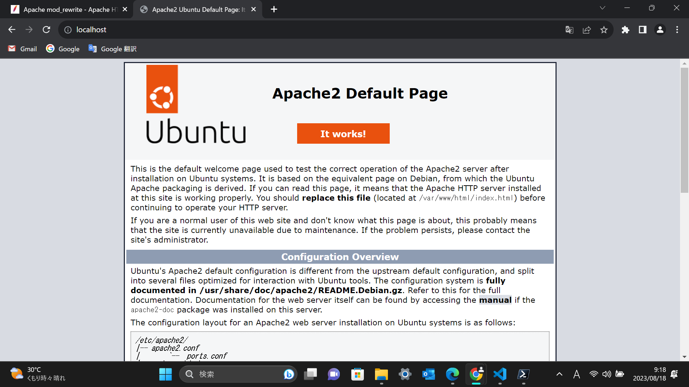

# 株式会社ハートビーツさんから出された課題「lamp環境の構築」の課程5
前回はLinux周りの設定が一通り終わった。ただこれ、lampのl(Linux)しか終わっていない。道のりは如何に。

## Apacheの設定
ヒントを見る限り、パッケージ管理ソフト"yum","dnf","apt"のうちいずれかを使用するようだ。

Ubuntuを使用しているのでaptを選択。

```
$ sudo apt install apache2
```

> Processing triggers for ufw (0.36.1-4build1) ...

インストール進行中にfirewallが動いている表示があった。

```
$ apt apache --version
apt 2.4.9 (amd64)
```

勘でコマンドを打ったが、正しいか心配になってきた。

```
$ apt list
```

aptでインストールしたアプリケーションを確認しようと考え、これを入れたらアプリケーション名が大量に表示されてしまった。

```
$ apt list --installed
```

--installedをつけたら表示がちょっと減った。

> apache2-bin/jammy-updates,now 2.4.52-1ubuntu4.6 amd64 [installed,automatic]
> apache2-data/jammy-updates,now 2.4.52-1ubuntu4.6 all [installed,automatic]
> apache2-utils/jammy-updates,now 2.4.52-1ubuntu4.6 amd64 [installed,automatic]
> apache2/jammy-updates,now 2.4.52-1ubuntu4.6 amd64 [installed]

apacheのバージョンが2.4系だと確認が取れた。

> apt/now 2.4.9 amd64 [installed,upgradable to: 2.4.10]

さっき表示されたバージョンはapt自体のバージョンという疑惑が浮上した。

'https://httpd.apache.org/docs/2.4/'
'https://httpd.apache.org/docs/2.4/en/'
このサイトを元に以下の要件を満たす必要がある

- Apacheは自動起動するように設定してください
- サーバが再起動しても自動でApacheが起動する
- -Webブラウザで`http://<自分の名字>-hbtask.local/` にアクセスすると「こんにちは。ありがとう。」と表示される
- Webブラウザで`http://<自分の名前>-hbtask.local/` にアクセスすると「ありがとう。こんにちは。」と表示される

自動起動と言えば、昨日よく見かけたenableコマンド。これを使用すると予想。

'https://httpd.apache.org/docs/2.4/en/invoking.html'

おっと、confファイルを探せときた。

```
$ cd /
$ httpd httpd.conf -f
Command 'httpd' not found
$ ls /usr/local/apache2
ls: cannot access '/usr/local/apache2': No such file or directory
$ ls /usr/local
bin  etc  games  include  lib  man  sbin  share  src
$ find httpd.conf
find: ‘httpd.conf’: No such file or directory
$ find apache2
find: ‘apache2’: No such file or directory
$ find apache
find: ‘apache’: No such file or directory
```

これまたどうしたものか。

昨日の作業時、libやetcディレクトリにアプリケーションが入っていた気がする。
とりあえず、見てみる。

```
$ ls /usr/lib
NetworkManager     dbus-1.0          hdparm           networkd-dispatcher  recovery-mode        tmpfiles.d
apache2            dpkg              init             openssh              rsyslog              ubuntu-advantage
apparmor           environment.d     initramfs-tools  os-release           sasl2                ubuntu-release-upgrader
apt                file              kernel           pam.d                snapd                udev
binfmt.d           firewalld         locale           pm-utils             software-properties  ufw
byobu              girepository-1.0  lsb              policykit-1          ssl                  usrmerge
cgi-bin            git-core          man-db           polkit-1             sysctl.d             valgrind
cnf-update-db      gnupg             mime             python2.7            systemd              wsl
command-not-found  gnupg2            modprobe.d       python3              sysusers.d           x86_64-linux-gnu
compat-ld          gold-ld           modules-load.d   python3.10           tc
console-setup      groff             netplan          python3.11
```

なかった

```
$ ls /usr/etc
ls: cannot access '/usr/etc': No such file or directory
```

etcディレクトリは幻覚だったのか？

昨日のファイルをファイル内検索したら

> $ cat /etc/selinux/config

これが実行出来ていたので、パスが違った。

```
$ ls /etc
PackageKit                     debconf.conf    issue           modules              rc0.d         sudo.conf
X11                            debian_version  issue.net       modules-load.d       rc1.d         sudo_logsrvd.conf
adduser.conf                   default         kernel          mtab                 rc2.d         sudoers
alternatives                   deluser.conf    ld.so.cache     nanorc               rc3.d         sudoers.d
apache2                        depmod.d        ld.so.conf      netconfig            rc4.d         sysctl.conf
apparmor                       dhcp            ld.so.conf.d    netplan              rc5.d         sysctl.d
apparmor.d                     dpkg            ldap            network              rc6.d         systemd
apport                         e2scrub.conf    legal           networkd-dispatcher  rcS.d         terminfo
apt                            environment     libaudit.conf   networks             resolv.conf   timezone
bash.bashrc                    ethertypes      libnl-3         newt                 rmt           tmpfiles.d
bash_completion                firewalld       locale.alias    nftables.conf        rpc           ubuntu-advantage
bash_completion.d              fstab           locale.gen      nsswitch.conf        rsyslog.conf  ucf.conf
bindresvport.blacklist         fuse.conf       localtime       opt                  rsyslog.d     udev
binfmt.d                       gai.conf        logcheck        os-release           screenrc      ufw
byobu                          groff           login.defs      pam.conf             security      update-manager
ca-certificates                group           logrotate.conf  pam.d                selinux       update-motd.d
ca-certificates.conf           group-          logrotate.d     passwd               services      vim
ca-certificates.conf.dpkg-old  gshadow         lsb-release     passwd-              shadow        vtrgb
chrony                         gshadow-        machine-id      perl                 shadow-       wgetrc
console-setup                  gss             magic           pm                   shells        wsl.conf
cron.d                         hdparm.conf     magic.mime      polkit-1             skel          xattr.conf
cron.daily                     host.conf       mailcap         ppp                  ssh           xdg
cron.hourly                    hostname        mailcap.order   profile              ssl           zsh_command_not_found
cron.monthly                   hosts           manpath.config  profile.d            subgid
cron.weekly                    init.d          mime.types      protocols            subgid-
crontab                        inputrc         mke2fs.conf     python3              subuid
dbus-1                         iproute2        modprobe.d      python3.
```

apache2を発見。

```
$ ls /etc/apache2
apache2.conf    conf-enabled  magic           mods-enabled  sites-available
conf-available  envvars       mods-available  ports.conf    sites-enabl
```

apache2.confを発見。
ports.confとかいうこの後使用しそうなファイルも発見。

```
$ cat /etc/apache2/apache2.conf
# This is the main Apache server configuration file.  It contains the
# configuration directives that give the server its instructions.
# See http://httpd.apache.org/docs/2.4/ for detailed information about
# the directives and /usr/share/doc/apache2/README.Debian about Debian specific
# hints.
#
#
# Summary of how the Apache 2 configuration works in Debian:
# The Apache 2 web server configuration in Debian is quite different to
# upstream's suggested way to configure the web server. This is because Debian's
# default Apache2 installation attempts to make adding and removing modules,
# virtual hosts, and extra configuration directives as flexible as possible, in
# order to make automating the changes and administering the server as easy as
# possible.

# It is split into several files forming the configuration hierarchy outlined
# below, all located in the /etc/apache2/ directory:
#
#       /etc/apache2/
#       |-- apache2.conf
#       |       `--  ports.conf
#       |-- mods-enabled
#       |       |-- *.load
#       |       `-- *.conf
#       |-- conf-enabled
#       |       `-- *.conf
#       `-- sites-enabled
#               `-- *.conf
#
#
# * apache2.conf is the main configuration file (this file). It puts the pieces
#   together by including all remaining configuration files when starting up the
#   web server.
#
# * ports.conf is always included from the main configuration file. It is
#   supposed to determine listening ports for incoming connections which can be
#   customized anytime.
#
# * Configuration files in the mods-enabled/, conf-enabled/ and sites-enabled/
#   directories contain particular configuration snippets which manage modules,
#   global configuration fragments, or virtual host configurations,
#   respectively.
#
#   They are activated by symlinking available configuration files from their
#   respective *-available/ counterparts. These should be managed by using our
#   helpers a2enmod/a2dismod, a2ensite/a2dissite and a2enconf/a2disconf. See
#   their respective man pages for detailed information.
#
# * The binary is called apache2. Due to the use of environment variables, in
#   the default configuration, apache2 needs to be started/stopped with
#   /etc/init.d/apache2 or apache2ctl. Calling /usr/bin/apache2 directly will not
#   work with the default configuration.


# Global configuration
#

#
# ServerRoot: The top of the directory tree under which the server's
# configuration, error, and log files are kept.
#
# NOTE!  If you intend to place this on an NFS (or otherwise network)
# mounted filesystem then please read the Mutex documentation (available
# at <URL:http://httpd.apache.org/docs/2.4/mod/core.html#mutex>);
# you will save yourself a lot of trouble.
#
# Do NOT add a slash at the end of the directory path.
#
#ServerRoot "/etc/apache2"

#
# The accept serialization lock file MUST BE STORED ON A LOCAL DISK.
#
#Mutex file:${APACHE_LOCK_DIR} default

#
# The directory where shm and other runtime files will be stored.
#

DefaultRuntimeDir ${APACHE_RUN_DIR}

#
# PidFile: The file in which the server should record its process
# identification number when it starts.
# This needs to be set in /etc/apache2/envvars
#
PidFile ${APACHE_PID_FILE}

#
# Timeout: The number of seconds before receives and sends time out.
#
Timeout 300

#
# KeepAlive: Whether or not to allow persistent connections (more than
# one request per connection). Set to "Off" to deactivate.
#
KeepAlive On

#
# MaxKeepAliveRequests: The maximum number of requests to allow
# during a persistent connection. Set to 0 to allow an unlimited amount.
# We recommend you leave this number high, for maximum performance.
#
MaxKeepAliveRequests 100

#
# KeepAliveTimeout: Number of seconds to wait for the next request from the
# same client on the same connection.
#
KeepAliveTimeout 5


# These need to be set in /etc/apache2/envvars
User ${APACHE_RUN_USER}
Group ${APACHE_RUN_GROUP}

#
# HostnameLookups: Log the names of clients or just their IP addresses
# e.g., www.apache.org (on) or 204.62.129.132 (off).
# The default is off because it'd be overall better for the net if people
# had to knowingly turn this feature on, since enabling it means that
# each client request will result in AT LEAST one lookup request to the
# nameserver.
#
HostnameLookups Off

# ErrorLog: The location of the error log file.
# If you do not specify an ErrorLog directive within a <VirtualHost>
# container, error messages relating to that virtual host will be
# logged here.  If you *do* define an error logfile for a <VirtualHost>
# container, that host's errors will be logged there and not here.
#
ErrorLog ${APACHE_LOG_DIR}/error.log

#
# LogLevel: Control the severity of messages logged to the error_log.
# Available values: trace8, ..., trace1, debug, info, notice, warn,
# error, crit, alert, emerg.
# It is also possible to configure the log level for particular modules, e.g.
# "LogLevel info ssl:warn"
#
LogLevel warn

# Include module configuration:
IncludeOptional mods-enabled/*.load
IncludeOptional mods-enabled/*.conf

# Include list of ports to listen on
Include ports.conf


# Sets the default security model of the Apache2 HTTPD server. It does
# not allow access to the root filesystem outside of /usr/share and /var/www.
# The former is used by web applications packaged in Debian,
# the latter may be used for local directories served by the web server. If
# your system is serving content from a sub-directory in /srv you must allow
# access here, or in any related virtual host.
<Directory />
        Options FollowSymLinks
        AllowOverride None
        Require all denied
</Directory>

<Directory /usr/share>
        AllowOverride None
        Require all granted
</Directory>

<Directory /var/www/>
        Options Indexes FollowSymLinks
        AllowOverride None
        Require all granted
</Directory>

#<Directory /srv/>
#       Options Indexes FollowSymLinks
#       AllowOverride None
#       Require all granted
#</Directory>


# AccessFileName: The name of the file to look for in each directory
# for additional configuration directives.  See also the AllowOverride
# directive.
#
AccessFileName .htaccess

#
# The following lines prevent .htaccess and .htpasswd files from being
# viewed by Web clients.
#
<FilesMatch "^\.ht">
        Require all denied
</FilesMatch>


#
# The following directives define some format nicknames for use with
# a CustomLog directive.
#
# These deviate from the Common Log Format definitions in that they use %O
# (the actual bytes sent including headers) instead of %b (the size of the
# requested file), because the latter makes it impossible to detect partial
# requests.
#
# Note that the use of %{X-Forwarded-For}i instead of %h is not recommended.
# Use mod_remoteip instead.
#
LogFormat "%v:%p %h %l %u %t \"%r\" %>s %O \"%{Referer}i\" \"%{User-Agent}i\"" vhost_combined
LogFormat "%h %l %u %t \"%r\" %>s %O \"%{Referer}i\" \"%{User-Agent}i\"" combined
LogFormat "%h %l %u %t \"%r\" %>s %O" common
LogFormat "%{Referer}i -> %U" referer
LogFormat "%{User-agent}i" agent

# Include of directories ignores editors' and dpkg's backup files,
# see README.Debian for details.

# Include generic snippets of statements
IncludeOptional conf-enabled/*.conf

# Include the virtual host configurations:
IncludeOptional sites-enabled/*.conf

# vim: syntax=apache ts=4 sw=4 sts=4 sr noet
```

このファイルを読み込めばapacheを起動できそうだが、どうすればいいのか。
ヒントにあったコマンドを実行してみる。

```
$ man systemctl
SYSTEMCTL(1)                                          systemctl                                          SYSTEMCTL(1)

NAME
       systemctl - Control the systemd system and service manager

SYNOPSIS
       systemctl [OPTIONS...] COMMAND [UNIT...]

DESCRIPTION
       systemctl may be used to introspect and control the state of the "systemd" system and service manager. Please
       refer to systemd(1) for an introduction into the basic concepts and functionality this tool manages.

COMMANDS
       The following commands are understood:

   Unit Commands (Introspection and Modification)
       list-units [PATTERN...]
           List units that systemd currently has in memory. This includes units that are either referenced directly
           or through a dependency, units that are pinned by applications programmatically, or units that were active
           in the past and have failed. By default only units which are active, have pending jobs, or have failed are
           shown; this can be changed with option --all. If one or more PATTERNs are specified, only units matching
           one of them are shown. The units that are shown are additionally filtered by --type= and --state= if those
           options are specified.

           Note that this command does not show unit templates, but only instances of unit templates. Units templates
           that aren't instantiated are not runnable, and will thus never show up in the output of this command.
           Specifically this means that foo@.service will never be shown in this list — unless instantiated, e.g. as
           foo@bar.service. Use list-unit-files (see below) for listing installed unit template files.
```

ヒントにsystemctlがあるということはsystemctlを使用するとみた。
昨日のファイルにて以下のコマンドを実行していた痕跡を発見。

> sudo systemctl stop apparmor
> systemctl status apparmor.service

```
$ sudo systemctl start apache
Failed to start apache.service: Unit apache.service not found.
$ sudo systemctl start apache2
$ systemctl status apache2
● apache2.service - The Apache HTTP Server
     Loaded: loaded (/lib/systemd/system/apache2.service; enabled; vendor preset: enabled)
     Active: active (running) since Fri 2023-08-18 07:50:47 JST; 1h 9min ago
       Docs: https://httpd.apache.org/docs/2.4/
   Main PID: 1338 (apache2)
      Tasks: 55 (limit: 9371)
     Memory: 21.2M
     CGroup: /system.slice/apache2.service
             ├─1338 /usr/sbin/apache2 -k start
             ├─1339 /usr/sbin/apache2 -k start
             └─1340 /usr/sbin/apache2 -k start

Aug 18 07:50:47 DESKTOP-F5G6OIO systemd[1]: Starting The Apache HTTP Server...
Aug 18 07:50:47 DESKTOP-F5G6OIO systemd[1]: Started The Apache HTTP Server.
```

起動だけなら成功した。

> preset: enabled

もしや自動起動も達成？

仮想マシンからログアウトして再度ログイン
```
$ systemctl status apache2
● apache2.service - The Apache HTTP Server
     Loaded: loaded (/lib/systemd/system/apache2.service; enabled; vendor preset: enabled)
     Active: active (running) since Fri 2023-08-18 07:50:47 JST; 1h 15min ago
       Docs: https://httpd.apache.org/docs/2.4/
   Main PID: 1338 (apache2)
      Tasks: 55 (limit: 9371)
     Memory: 21.2M
     CGroup: /system.slice/apache2.service
             ├─1338 /usr/sbin/apache2 -k start
             ├─1339 /usr/sbin/apache2 -k start
             └─1340 /usr/sbin/apache2 -k start

Aug 18 07:50:47 DESKTOP-F5G6OIO systemd[1]: Starting The Apache HTTP Server...
Aug 18 07:50:47 DESKTOP-F5G6OIO systemd[1]: Started The Apache HTTP Server.
```

> preset: enabled

起動しているということは"localhost"でwebページを表示できるはず。
以前apacheを使用したときはそうだった。

> 

表示できた。

公式ドキュメントではhttpd.confで色々設定するとあるが、そもそもそんなファイルがない。

"localhost"で表示されたデフォルトページにパスが載っていた。

> You should replace this file (located at /var/www/html/index.html) before continuing to operate your HTTP server.

```
$ ls /var/www/html
index.html
```

"localhost"で表示されたデフォルトページ、色々書いてある。

> Ubuntu's Apache2 default configuration is different from the upstream default configuration, and split into several files optimized for interaction with Ubuntu tools. The configuration system is fully documented in /usr/share/doc/apache2/README.Debian.gz. Refer to this for the full documentation. 

どうりで公式ドキュメントと異なるわけだ。

>The binary is called apache2 and is managed using systemd, so to start/stop the service use systemctl start apache2 and systemctl stop apache2, and use systemctl status apache2 and journalctl -u apache2 to check status. 

"systemctl start apache2"のコマンド、ここに書いてあった。

> ports.conf is always included from the main configuration file.

"ports.conf"の中身が重要そう。

> The default Ubuntu document root is /var/www/html. You can make your own virtual hosts under /var/www.

なるほど、要件を達成できそうな気がしてきた。
- -Webブラウザで`http://<自分の名字>-hbtask.local/` にアクセスすると「こんにちは。ありがとう。」と表示される
- Webブラウザで`http://<自分の名前>-hbtask.local/` にアクセスすると「ありがとう。こんにちは。」と表示される

```
$ cd /var/www/html
$ touch familyname-hbtask
$ touch firstname-hbtask
$ sudo vim familyname-hbtask
$ sudo vim firstname-hbtask
$ mv firstname-hbtask firstname-hbtask.local
mv: cannot move 'firstname-hbtask' to 'firstname-hbtask.local': Permission denied
$ sudo mv firstname-hbtask firstname-hbtask.local
$ sudo mv familyname-hbtask familyname-hbtask.local
```

ここに本名を書くと、リポジトリがpublicである以上、全世界に公開されてしまうので、ちょっと改変。

コマンド操作を細々とミスした。

firstname-hbtask.localの中身
```
<!DOCTYPE html>
<html lang="ja">
<head>
    <meta charset="UTF-8">
    <meta name="viewport" content="width=device-width, initial-scale=1.0">
    <title>thanks</title>
</head>
<body>
    <p>ありがとう。こんにちは。</p>
</body>
</html>
```

familyname-hbtask.localの中身
```
<!DOCTYPE html>
<html lang="ja">
<head>
    <meta charset="UTF-8">
    <meta name="viewport" content="width=device-width, initial-scale=1.0">
    <title>hello</title>
</head>
<body>
    <p>こんにちは。ありがとう。</p>
</body>
</html>
```

```
$ sudo mv firstname-hbtask.local firstname-hbtask.local.html
$ sudo mv familyname-hbtask.local familyname-hbtask.local.html
```

Webページが表示されなくなってしまった。

今日中にはapacheの設定をおわらせたかったのだが。
初めての環境構築で使用したローカルサーバーはxamppだったので、初めてがいっぱい。